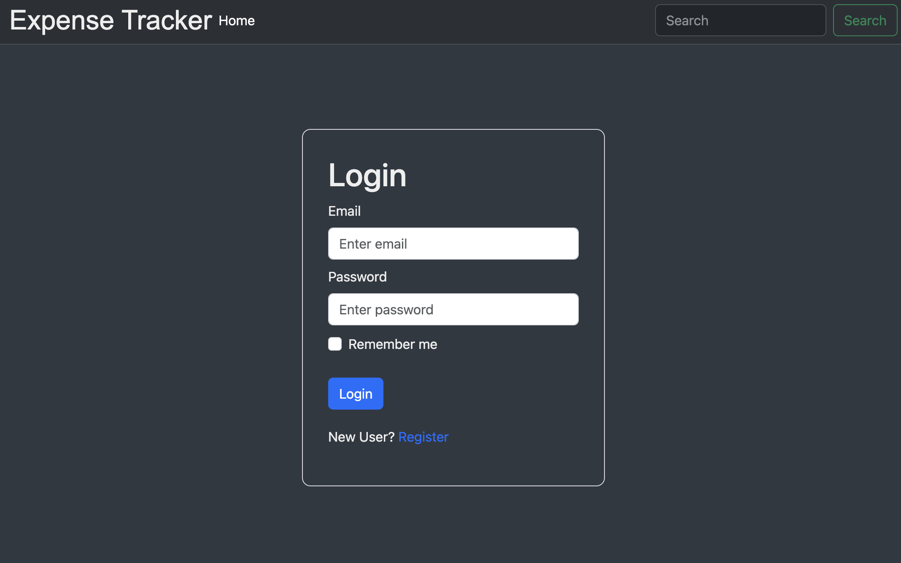
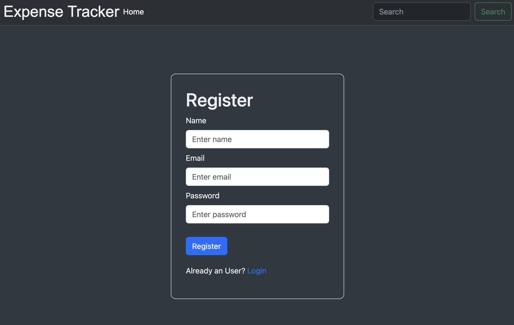
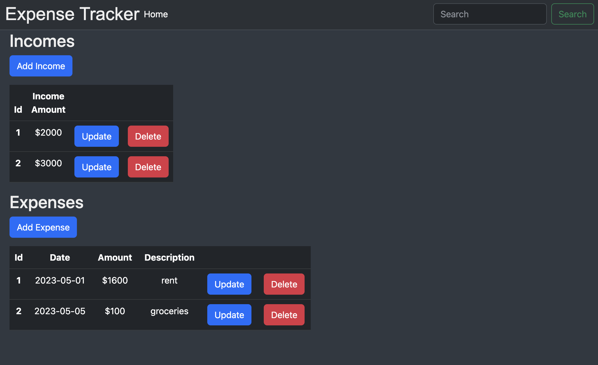

# ExpenseTracker

## Table of Contents
[Overview](#overview)  
[Tools and Technologies](#tools-and-technologies)  
[User Stories](#user-stories)  
[Routes](#routes)  
[CLI Commands](#cli-commands)   
[Resources](#resources)

## Overview
A front-end application that allows users to add, update and delete their income and expenses.  

## Tools and Technologies
* Angular
* VSCode - IDE
* Bootstrap 

## User Stories
* As a user, I am able to create or login into my account in order to use the expense tracker application.
* As a user, I am able to enter an income amount in order to set a spending limit amount.
* As a user, I am able to enter a new expense entry with details such as date, amount, description.
* As a user, I am able to update an expense entry if needed.
* As a user, I am able to delete an expense entry that is no longer needed.
* As a user, I am able to view a list of incomes.
* As a user, I am able to update an income entry if needed.
* As a user, I am able to delete an income entry that is no longer needed.

## Routes
* Main page / Login page  
http://localhost:4200/login
* User Registration  
http://localhost:4200/register
* User Dashboard  
http://localhost:4200/user-dashboard

## CLI Commands
`ng serve` - to run dev server, on `http://localhost:4200/`.  
`ng build` - to build the project. The build artifacts will be stored in the `dist/` directory.

## Resources 
* [Bootstrap](https://ng-bootstrap.github.io)
* [SheCodes](https://palettes.shecodes.io)

## Acknowledgements
Big thanks to [Maksym Zinchenko](https://github.com/maklaut007) and [Leonardo Rodriguez](https://github.com/LRodriguez92).
